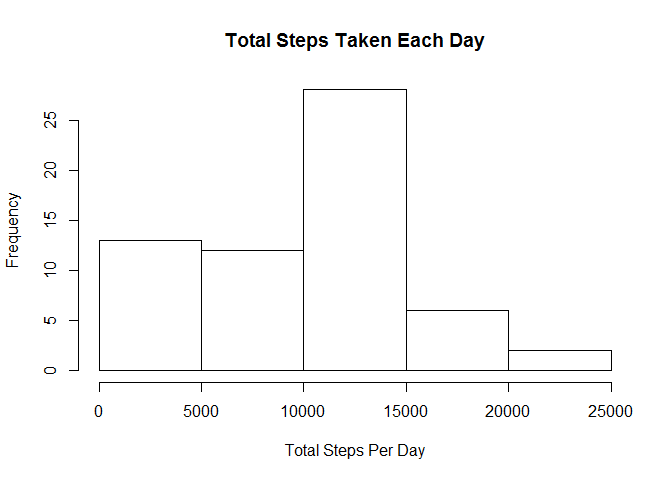
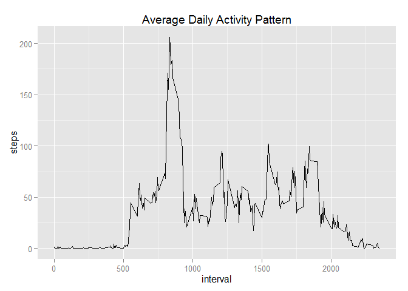

# Reproducible Research: Peer Assessment 1


## Loading and preprocessing the data
Read the activity.csv file, and transform date column into date format.

```r
data = read.csv(unz("activity.zip", "activity.csv"), stringsAsFactors = F, header = T)
data$date = as.Date(data$date)
```


## What is mean total number of steps taken per day?
Histogram of total number of steps taken each day:

```r
totalSteps = aggregate(data$steps, list(data$date), sum, na.rm=T)
hist(totalSteps$x, main = "Total Steps Taken Each Day", xlab="Total Steps Per Day")
```

 

From this summary we can tell the mean and median of total number of steps taken per day

```
##    Min. 1st Qu.  Median    Mean 3rd Qu.    Max. 
##       0    6780   10400    9350   12800   21200
```

## What is the average daily activity pattern?
Calculate average steps based on 5 minutes interval

```r
avgStep = aggregate(data$steps, list(data$interval), mean, na.rm=T)
names(avgStep) = c("interval", "steps")
```

Plot showing average steps taken in 5 minutes interval through out the day
 


On average across all the days, maximum steps were taken in 835 interval which is about 207 steps.

## Imputing missing values


## Are there differences in activity patterns between weekdays and weekends?
