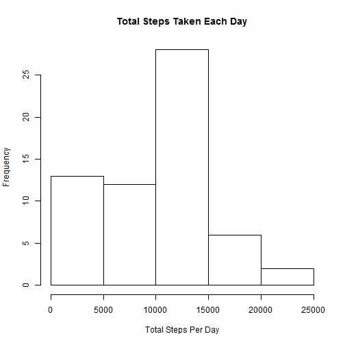
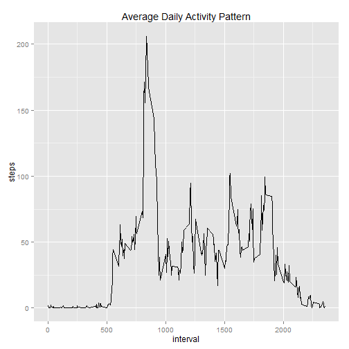
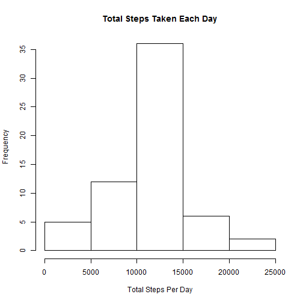
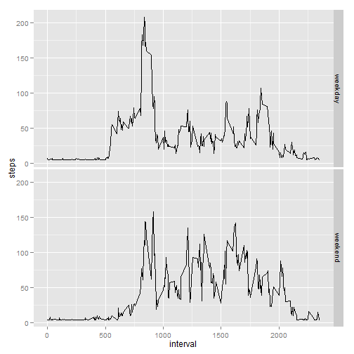

## Loading and preprocessing the data
Read the activity.csv file, and transform date column into date format.

```r
data = read.csv(unz("activity.zip", "activity.csv"), stringsAsFactors = F, header = T)
data$date = as.Date(data$date)
```


## What is mean total number of steps taken per day?
1. Histogram of total number of steps taken each day:

```r
totalSteps = aggregate(data$steps, list(data$date), sum, na.rm = T)
hist(totalSteps$x, main = "Total Steps Taken Each Day", xlab="Total Steps Per Day")
```

 

2. From this summary we can tell the mean and median of total number of steps taken per day

```r
summary(totalSteps$x)
```

```
##    Min. 1st Qu.  Median    Mean 3rd Qu.    Max. 
##       0    6780   10400    9350   12800   21200
```

## What is the average daily activity pattern?
Calculate average steps based on 5 minutes interval, missing value ignored.

```r
avgStep = aggregate(data$steps, list(data$interval), mean, na.rm=T)
names(avgStep) = c("interval", "steps")
```

Plot showing average steps taken in 5 minutes interval through out the day

```r
library(ggplot2)
qplot(interval, steps, data = avgStep, geom = "line", main = "Average Daily Activity Pattern")
```

 


```r
maxSteps = avgStep[which.max(avgStep$steps),]
```
On average across all the days, maximum steps were taken in 835 interval which is about 207 steps.

## Imputing missing values
There are 2304 missing values of steps in the data. Therefore the strategy for filling in all of the missing values in the dataset we use is by replacing the NA's with average value of steps of a day in 5 minutes interval, which is 38 steps per 5 minutes interval.

We create new dataset with missing data filled in.

```r
newData = data
newData[is.na(newData$steps),1] = 38
```

Histogram of total number of steps taken each day:

```r
itotalSteps = aggregate(newData$steps, list(newData$date), sum)
hist(itotalSteps$x, main = "Total Steps Taken Each Day", xlab="Total Steps Per Day")
```

 

From this summary we can tell the mean and median of total number of steps taken per day

```r
summary(itotalSteps$x)
```

```
##    Min. 1st Qu.  Median    Mean 3rd Qu.    Max. 
##      41    9820   10900   10800   12800   21200
```
Since we replace NA value with average steps a day in 5 minutes interval, we have a different result in median and mean.

## Are there differences in activity patterns between weekdays and weekends?
We create a new factor variable in the data set with two levels - "weekday" and "weekend" indicating whether a given date is a weekday or weekend day.

```r
newData2 = newData
newData2[,4] = rep("weekday", nrow(newData2))
colnames(newData2) = c("steps", "date", "interval", "wd")
for(i in 1:nrow(newData2)){
        if(weekdays(newData2[i,2])=="Saturday" || weekdays(newData2[i,2])=="Sunday"){
                newData2[i,4] = "weekend"
        }
}
newData2[,4] = as.factor(newData2[,4])
```

Panel plot containing a time series plot of the 5-minute interval (x-axis) and the average number of steps taken, averaged across all weekday days or weekend days (y-axis).

```r
wdSteps = aggregate(newData2$steps, list(newData$interval,newData2$wd), mean)
colnames(wdSteps) = c("interval", "wd", "steps")
qplot(interval, steps, data = wdSteps, geom="line", facets=wd ~ .)
```

 

From the plot above, it seems that there is more steps taken through out the day in the weekend.
